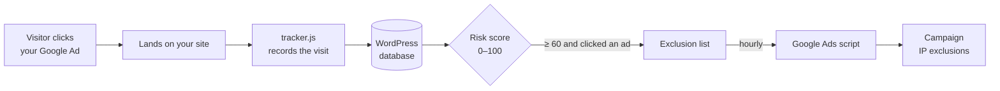

<div align="center">

# 🛡️ ClickWarden

### Click Fraud Protection for Google Ads

**Detect invalid Google Ads clicks on your own WordPress site and exclude fraudulent IPs from your campaigns automatically.**
Free, self-hosted, cache friendly. No subscription, no account, no SaaS.

[](LICENSE)
[](https://wordpress.org)
[](https://www.php.net)
[](https://wordpress.org/download/)

[Features](#-features) · [How it works](#-how-it-works) · [Installation](#-installation) · [Setup](#-setup-in-4-steps) · [FAQ](#-faq) · [Privacy](#-privacy--external-services) · [Developers](#-for-developers)

</div>

---

## 💸 Why ClickWarden?

Competitors, click farms and bots can burn through your Google Ads budget in hours. Google refunds only part of it, and blocking visitors on your website does not help: **the click is already charged before the visitor reaches your site.**

The only thing that stops the bleeding is keeping those IPs out of your campaigns. ClickWarden does that for you:

1. It watches every ad click that lands on your site.
2. It scores each visitor for fraud (0–100).
3. It pushes suspicious IPs into the **IP exclusions of your Google Ads campaigns — every hour, automatically.**

Everything runs on your own WordPress site. Your visitor data never goes to a third-party click-fraud service.

## ✨ Features

| | |
|---|---|
| ⚡ **Cache & CDN friendly** | Tracking runs in the browser, so it works behind LiteSpeed Cache, WP Rocket, Autoptimize, SiteGround Optimizer and host CDNs. The tracker is excluded from JS optimization automatically. |
| 🎯 **Accurate click counting** | Page reloads with the same click id (`gclid`, `gbraid`, `wbraid`) are counted once — just like Google Ads charges them. |
| 🔁 **IP-rotation detection** | Recognizes the *same browser* clicking your ads from several IPs, using existing Google Analytics / Google Ads cookies. ClickWarden never sets cookies itself. |
| 🤖 **Bot detection** | Search engines, AI crawlers, SEO tools, uptime monitors, headless browsers and HTTP libraries. Google's own AdsBot is recognized and never flagged. |
| 🌐 **Network intelligence** | Optional lookups flag datacenter, VPN, proxy and Tor IPs — the strongest fraud signals. Choose your provider: **ipapi.is** or **proxycheck.io**, both with a free daily quota. |
| 🔄 **Google Ads sync** | A ready-made Google Ads script syncs the exclusion list hourly. Your manual exclusions stay untouched and the 500 IPs per campaign limit is respected. |
| 📊 **Reports** | Dashboard, 14-day chart, riskiest IPs, campaigns under attack, filterable visit and IP reports, CSV export. |
| ✅ **Full control** | Whitelist or flag any IP, exclude your office IPs, tune every threshold. |
| 🔒 **Privacy built in** | Automatic data cleanup, suggested privacy policy text, staff visits never tracked. |
| 🌍 **Translatable** | English and Turkish included. |

## 🧠 How it works



### Risk score

Each IP gets a score from **0 to 100**. A single signal is never enough to reach the default *suspicious* threshold of **60**, so real customers are not blocked because of one odd visit.

| Signal | Points |
|---|---:|
| Automated browser (WebDriver, Puppeteer, Playwright, curl …) | +50 |
| Repeated ad clicks from the same IP **or browser** (default: 3 in 24 h) | +40 |
| A bot clicked an ad | +40 |
| Ad click without any interaction or time on page | +20 each, max +40 |
| Same browser, several IP addresses | +30 |
| Datacenter / hosting network | +30 |
| Proxy / VPN / Tor | +30 |
| Two ad clicks (below the repeat threshold) | +20 |
| Click from outside your target countries | +20 |
| Request flood (above the per-minute limit) | +20 |

| Level | Default score | What happens |
|---|---|---|
| 🟢 Clean | 0–29 | Nothing |
| 🟡 Watch | 30–59 | Shown in reports, not excluded |
| 🔴 Suspicious | 60–100 | Added to the Google Ads exclusion list *(only if it clicked an ad)* |

All thresholds can be changed under **ClickWarden → Settings**.

## 📦 Installation

**Requirements:** WordPress 6.5+ and PHP 8.1+.

**From a release ZIP**

1. Download `clickwarden.zip` from the [Releases](https://github.com/hakanispirli/clickwarden/releases) page.
2. In WordPress go to **Plugins → Add New → Upload Plugin**, choose the ZIP and click **Install Now**.
3. Click **Activate**.

**From source**

```bash
cd wp-content/plugins
git clone https://github.com/hakanispirli/clickwarden.git
```

Then activate **ClickWarden** under **Plugins**.

> [!IMPORTANT]
> **Purge your page cache and CDN once after installing.** Pages cached before ClickWarden was active do not contain the tracker.

## 🚀 Setup in 4 steps

The **Overview** tab shows a checklist that ticks itself off as you go.

**1. Receive your first visits**
Open your site in a private browser window. The visit should appear under **ClickWarden → Visits** within seconds.

**2. Exclude your own IP**
Go to **Settings → Excluded IPs** and add your office and team IPs (single IPs or CIDR ranges such as `88.1.2.0/24`). Your current IP is shown right below the field.

**3. Enable network lookups**
Under **Settings → Network lookups**, turn on *Look up visitor IP addresses* and pick a provider:

| Provider | Free quota | API key | Commercial use |
|---|---|---|---|
| [ipapi.is](https://ipapi.is) | 1,000 lookups / day | Optional (free key recommended) | ✅ |
| [proxycheck.io](https://proxycheck.io) | 100 / day without key, 1,000 / day with a free key | Optional | ✅ |

Only the IP address (and your API key, if set) is sent, in the background, once a minute. IPs that clicked an ad are looked up first and each IP at most once every 30 days. Also set your **target countries** (e.g. `US, CA`).

**4. Connect Google Ads**
1. Go to **ClickWarden → Google Ads** and enter the exact names of the campaigns to protect, one per line.
2. Click **Copy script**.
3. In Google Ads open **Tools → Bulk actions → Scripts**, click **+ → New script**, delete the sample code and paste.
4. Click **Authorize**, then **Preview** — the log shows what would change, nothing is modified.
5. **Save** and set the frequency to **Hourly**.

After the first real run, *Last sync* on the Google Ads tab shows how many IPs were added or removed.

> [!TIP]
> The script contains your site address and a secret access key. If it was shared by mistake, click **Create new key** on the Google Ads tab and paste the updated script.

> [!NOTE]
> **WP-Cron runs only when your site gets traffic.** For reliable lookups on low-traffic sites, add a real cron job that calls `wp-cron.php` every minute. The exact command is shown on the Settings tab.

## ❓ FAQ

<details>
<summary><b>Does blocking an IP on my website stop the click charge?</b></summary>

No. Google charges the click before the visitor reaches your site. That is why ClickWarden does not block visitors on your site; it adds fraudulent IPs to your campaign IP exclusions in Google Ads, so your ads are no longer shown to them.
</details>

<details>
<summary><b>Will real customers be blocked?</b></summary>

A single signal is never enough to reach the default suspicious score of 60. Mobile carriers often share one IP among many people, so repeated clicks alone only put an IP on the watch list. You can whitelist any IP, and whitelisted IPs are removed from Google Ads on the next sync.
</details>

<details>
<summary><b>Why do I see fewer ad clicks than in Google Ads?</b></summary>

Bots that do not run JavaScript never load the tracker. A large gap between the two numbers is itself a sign of invalid traffic. Google also filters part of the invalid clicks itself; see the *Invalid clicks* column in Google Ads.
</details>

<details>
<summary><b>No visits are recorded. What should I do?</b></summary>

Your pages are probably served from a page cache or CDN created before ClickWarden was installed. Purge all caches (plugin and hosting/CDN). If you use a JavaScript optimization plugin, exclude `clickwarden/assets/js/tracker.js` from combining and delaying.
</details>

<details>
<summary><b>Does it work with Performance Max campaigns?</b></summary>

The script manages campaign-level IP exclusions, which apply to the whole campaign including all ad groups. Google Ads decides which campaign types accept IP exclusions; campaigns that do not are reported on the Google Ads tab.
</details>

<details>
<summary><b>Is it really free? Are there premium features?</b></summary>

Yes, it is completely free and open source under the GPL. There are no paid tiers, license keys, usage limits or locked features.
</details>

## 🔐 Privacy & external services

ClickWarden stores visitor IP addresses, user agents, visited paths, referrers, ad click identifiers and identifiers from existing Google cookies **in your own WordPress database**. Data older than the retention period (30 days by default) is deleted automatically. A suggested text is added to **Settings → Privacy**. Logged-in editors and administrators are never tracked.

**Nothing is sent to any external service until you enable it.**

| Service | When | Data sent | Links |
|---|---|---|---|
| **ipapi.is** | Only when lookups are enabled **and** ipapi.is is the selected provider | Visitor IP, your API key (if set). At most once per IP every 30 days. | [Terms](https://ipapi.is/terms.html) · [Privacy](https://ipapi.is/privacy.html) |
| **proxycheck.io** | Only when lookups are enabled **and** proxycheck.io is the selected provider | Visitor IP, your API key (if set). At most once per IP every 30 days. | [Terms](https://proxycheck.io/terms) · [Privacy](https://proxycheck.io/privacy) |
| **ip-api.com** | Only when the fallback option is enabled | Visitor IP, your Pro key (if set). The free endpoint is HTTP-only and non-commercial. | [Terms & Privacy](https://ip-api.com/docs/legal) |
| **Google Ads** | Only if you install the script | ClickWarden never connects to Google. The script in *your* Google Ads account calls *your* site (secured with a secret key) to fetch the exclusion list and report results. | [Google Ads Scripts](https://developers.google.com/google-ads/scripts) · [Privacy](https://policies.google.com/privacy) |

## 🛠 For developers

### Project structure

```
clickwarden/
├── clickwarden.php              # Bootstrap, cron, activation, privacy text
├── uninstall.php                # Removes all tables, options and cron events
├── includes/
│   ├── class-tracker.php        # Enqueues tracker.js, cache-plugin exclusions
│   ├── class-rest.php           # Public beacon endpoints (/hit, /engage)
│   ├── class-ads-sync.php       # Token-protected Google Ads endpoints
│   ├── class-risk-scorer.php    # 0–100 risk score
│   ├── class-bot-detector.php   # User-agent classification
│   ├── class-ip-info.php        # Client IP resolution, ipapi.is / proxycheck.io / ip-api.com
│   ├── class-database.php       # Custom tables and queries
│   ├── class-settings.php       # Settings API
│   ├── class-admin.php          # Admin screens and actions
│   └── class-list-table-*.php   # WP_List_Table reports
├── templates/                   # Admin tab templates
├── assets/
│   ├── js/tracker.js            # Front-end beacon (no dependencies)
│   ├── js/admin.js
│   ├── css/admin.css
│   └── google-ads-script.js     # Google Ads script template
└── languages/                   # .pot + Turkish translation
```

### REST endpoints

| Route | Auth | Purpose |
|---|---|---|
| `POST /wp-json/clickwarden/v1/hit` | Public, rate limited | Records a page view |
| `POST /wp-json/clickwarden/v1/engage` | Public | Updates time on page, scroll, interaction |
| `POST /wp-json/clickwarden/v1/ads/list` | `X-ClickWarden-Token` header | IPs to block / unblock |
| `POST /wp-json/clickwarden/v1/ads/ack` | `X-ClickWarden-Token` header | Sync result from the Google Ads script |

The beacon endpoints must be unauthenticated because cached pages cannot carry a valid nonce. The IP and user agent are always taken from the server, never from the request body, and every payload is validated.

### Filters

```php
// Disable tracking on specific pages.
add_filter('clickwarden_should_track', function (bool $track): bool {
    return $track && !is_page('checkout');
});
```

### Building a release ZIP

Development files are marked `export-ignore` in `.gitattributes`, so `git archive` produces a clean, WordPress.org-ready package:

```bash
git archive --format=zip --prefix=clickwarden/ -o clickwarden.zip HEAD
```

### Translations

Translations live in `languages/`. To add a language, copy `clickwarden.pot` to `clickwarden-{locale}.po`, translate it with [Poedit](https://poedit.net), and send a pull request. Once the plugin is on WordPress.org, translations can also be contributed on [translate.wordpress.org](https://translate.wordpress.org).

## 🤝 Contributing

Bug reports, ideas and pull requests are welcome.

1. [Open an issue](https://github.com/hakanispirli/clickwarden/issues) describing the bug or idea.
2. Fork the repository and create a branch.
3. Follow the [WordPress Coding Standards](https://developer.wordpress.org/coding-standards/) and keep every string translatable with the `clickwarden` text domain.
4. Open a pull request.

## 📄 License

ClickWarden is free software, released under the **[GNU General Public License v2.0 or later](LICENSE)** — the same license as WordPress.

You may use, study, modify and redistribute it, including for commercial client work, as long as derivative works remain under the GPL.

---

<div align="center">

Made with care by **[Webmarka](https://webmarka.com)** · We use ClickWarden on our own client campaigns and share it free of charge.

</div>
